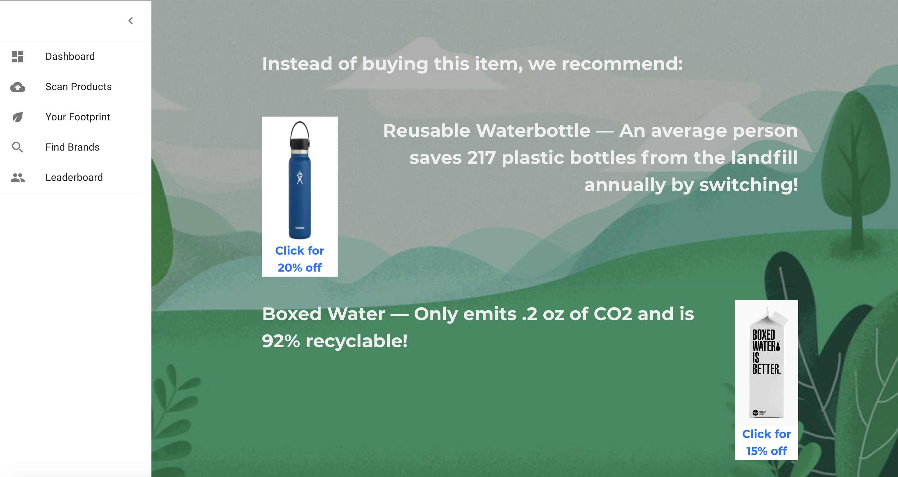

Our Mission: To promote environmentally friendly brands to a group of environmentally concerned customers, by so doing encourage companies that do not use sustainable packaging to make the switch. 

Built using the MERN stack (ReactJS), computer vision libraries, and material UI. 

## Using computer vision to scan an unsustainable product which recommends alternatives to help the planet 

## Scanning a sustainable product

## Track your CO2 savings 

## Discover sustainable curated by The Green Revolution or search for your own

## Compete with your friends

